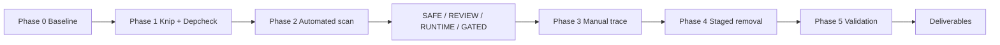

# Dead Code Audit Report

**Project:** Mithron Flight Systems (`mithuuu`)  
**Date:** 2026-07-02  
**Constraint:** Conservative cleanup; `destructiveCleanupAllowed: false` in `services/enterprise-cleanup.ts`

## Executive summary

Automated discovery (knip + depcheck) and manual verification identified **32 safe removals** (~1,454 LOC), primarily:

1. Orphan libraries/services with zero runtime references  
2. Legacy admin nav/topbar superseded by platform shell  
3. Unmounted product showcase section cluster (11 files)  
4. Orphan npm scripts and one generated docs artifact  

**No** database migrations, auth/RBAC modules, payment webhooks, or enterprise-gated CMS fallbacks were removed.

Post-cleanup knip reports **4** remaining unused files — all blocked by contract tests or e2e expectations (see `review-queue.md`).

## Methodology

### Phase 0 — Baseline

See `baseline.md`: ~1,280 files, ~140.5k LOC, 79 pages, 38 API routes, 113 migrations.

### Phase 1 — Tooling

- Installed `knip`, `depcheck` (devDependencies)
- Added `knip.json` with Next.js App Router, Vitest, Playwright entries; ignores `tools/`, `data/`, `supabase/`
- Added `tools/dead-code-audit.mjs` with corrected knip JSON parsing (issues → `files[]` / `exports[]`)
- Scripts: `audit:dead-code`, `audit:knip`, `audit:depcheck`

### Phase 2 — Automated findings

Initial scan: **28** unused files, **114** unused exports.  
Depcheck flagged `tailwindcss`, `@tailwindcss/postcss`, `supabase` — confirmed false positives (PostCSS config / CLI).

Output: `automated-findings.json` with tags and `testReferenced` flags.

### Phase 3 — Manual verification

Mandatory checks applied:

- `rg` for symbol and path references  
- Contract tests reading source via `readFileSync`  
- `ENTERPRISE_CLEANUP_DEPENDENCIES` cross-check  
- `package.json` script cross-reference for `scripts/` and `tools/`

**Key finding:** Many knip “unused” files are **source contract tests** — files exist to enforce markup/security invariants without being imported by the app.

### Phase 4 — Removals

32 files removed; details in `removals.md`.  
One test updated: `tests/motion-audit-regression.test.ts` (removed reference to deleted `product-narrative-chapters.tsx`).

### Phase 5 — Validation

| Gate | Result |
|------|--------|
| Typecheck | PASS |
| Build | PASS |
| Full test suite | FAIL (72 pre-existing failures) |
| Motion audit (touched) | PASS |
| Lint | FAIL (pre-existing) |

See `validation.md`.

## Findings by category

| Tag | Count (initial files) | Action taken |
|-----|----------------------:|--------------|
| SAFE (verified) | 24 files | Removed |
| REVIEW | 4 files remain | Queued |
| RUNTIME | 38 API routes, pages | Kept |
| GATED | CMS fallbacks | Kept |

## Impact

| Area | Impact |
|------|--------|
| Bundle size | Modest — removed mostly unmounted sections and dead libs |
| Maintainability | **Primary win** — fewer orphan modules and clearer PDP showcase surface |
| CI time | Slight reduction from fewer files / script tests |
| Risk | Low — typecheck + build green; no runtime entry points removed |

## Recommendations (follow-up, out of scope)

1. **Contract test migration** — Point tests at shipped components (`PlatformShell`) instead of orphan `*-frame.tsx` files, then remove the 4 remaining unused files.  
2. **Unused exports** — Audit CMS/warehouse server actions with form-action grep; remove dead exports in isolated PRs.  
3. **CSS cleanup** — Remove `.reveal` classes from `product-showcase.module.css` after class-name grep.  
4. **Fix `scripts/remove-backgrounds-upload.cmd`** — References deleted `upload-to-supabase.mjs`.  
5. **Pre-existing lint/test debt** — 72 failing contract tests and 10 lint errors should be triaged separately.

## Deliverables index

| File | Description |
|------|-------------|
| `baseline.md` | Pre-audit metrics |
| `after.md` | Post-audit metrics |
| `automated-findings.json` | Machine-readable knip/depcheck output |
| `removals.md` | Removal log with evidence |
| `review-queue.md` | Items requiring human decision |
| `validation.md` | Pipeline results |
| `report.md` | This document |
