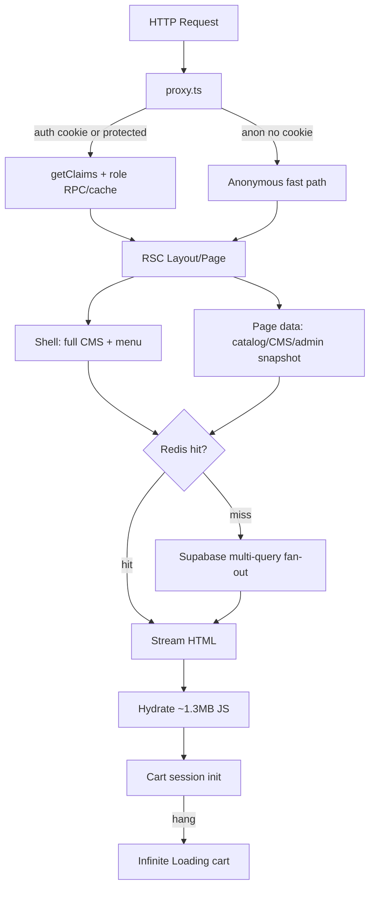

# Full Static Performance & Reliability Audit — Mithron (mithuuu)

**Date:** 2026-07-18  
**Project:** Mithron Flight Systems (`mithuuu/mithuuu`)  
**Production URL (reference):** `https://final-mithron-deploy.vercel.app`  
**Scope:** Fresh from-scratch static analysis across all 13 phases (architecture, runtime patterns, Supabase, Redis, Vercel config, React, Next.js, auth, images, bundles, infinite loading, action latency).  
**Method:** Code + config + migrations + existing `.next` bundle diagnostics. **No live** Vercel/Supabase/Upstash telemetry, no `EXPLAIN ANALYZE` against production, no multi-user load simulation.  
**Deliverable:** Report only — zero code changes in this pass.

---

## Methodology caveats (read first)

| Phase | Status in this audit |
|-------|----------------------|
| Architecture / Next.js / React / Redis / Images / Bundles / Action paths | Fully covered via static analysis |
| TTFB / FCP / LCP / INP / CLS / cold starts | **Not measured** — requires live browser + Vercel Speed Insights |
| `EXPLAIN ANALYZE` / seq scans / lock waits | **Inferred** from query shapes vs migration indexes |
| Redis hit/miss ratio, memory, hot keys | **Not measured** — requires Upstash dashboard |
| 1→500 concurrent user simulation | **Not run** — requires `npm run test:load` against a target |
| Production logs / function duration | **Not pulled** — requires Vercel MCP auth |

Scores below are **static-evidence scores**, not production Lighthouse scores.

---

## Stack snapshot (verified)

| Area | Count / note |
|------|----------------|
| Services (`services/*.ts`) | 71 |
| Supabase migrations | 148 |
| App `page.tsx` routes | 81 |
| Next.js | `^16.2.6` (proxy convention via `proxy.ts`, no `middleware.ts`) |
| React | `^19.2.6` |
| Data | Supabase PostgREST + RLS |
| Redis | Upstash REST (`@upstash/redis` + `@upstash/ratelimit`) — rate limit **and** app-data cache |
| Deploy | Vercel (`.vercelignore` present; `vercel.json` redirects + crons) |

---

## 1. Root Cause Summary

The product’s latency and “infinite loading” symptoms are **not** primarily caused by Redis being “broken,” Supabase being “down,” or Vercel cold starts alone. The dominant root causes are **architectural fan-out and unbounded client waits**:

1. **Storefront shell over-fetch** — Every storefront layout loads a **full CMS snapshot** (~10 tables) to render nav/footer only ([`services/cms.ts`](../services/cms.ts) `loadStorefrontShellCms` ~L894–900). Combined with homepage bundle cold loads, this dominates anonymous and signed-in TTFB on cache miss.

2. **Fake streaming on homepage** — Hero and below-fold Suspense both await the same `getHomepageBundle()` ([`sections/home/home-page-content.tsx`](../sections/home/home-page-content.tsx) L10–33). `React.cache` collapses them to one promise → Suspense cannot stream progressively.

3. **Control-plane payload bloat** — `getWarehouseSnapshot` fans out 8–11 tables (orders include `metadata,timeline`) capped at 80 rows and ships to large client workspaces ([`services/admin.ts`](../services/admin.ts) L1282–1451). Admin/warehouse/supplier dashboards feel slow because SSR + hydration carry operational graphs, not because a single index is missing.

4. **Action latency = sequential pipelines** — Product save / supplier update dominated by **image encode + multi-variant storage**; warehouse dispatch runs **multiple full lifecycle advances** sequentially ([`app/warehouse/actions.ts`](../app/warehouse/actions.ts) L1528–1618); enquiry notify loops admins one-by-one.

5. **Infinite loading = cart session bootstrap without timeouts** — Checkout/cart/drawer gate on `isCartSessionReady`. Init awaits `supabase.auth.getSession()` and authenticated cart `fetch` with **no timeout** ([`lib/cart/cart-auth-sync.ts`](../lib/cart/cart-auth-sync.ts) L156–189). A hung Supabase client leaves “Loading cart…” forever.

6. **Client JS weight** — Storefront first-load JS ~1.3MB uncompressed (from `.next/diagnostics/route-bundle-stats.json`), including a ~108–126KB remote asset map in the client bundle and incomplete code-splitting for catalog listing / assistant panel.

7. **Redis is helping, not hurting** — Upstash backs rate limits (atomic via `@upstash/ratelimit`) **and** short-TTL read-through caches / single-flight / cron locks. Removing Redis would increase Supabase fan-out on Vercel multi-instance. Remaining Redis issues are Gemini TPM non-atomic INCR+EXPIRE and auth-lockout round-trips — not cache stampede of catalog.

8. **Signed-in storefront tax** — Anonymous public traffic correctly skips Supabase in `proxy.ts` (L462–464). Any auth cookie forces `getClaims` + role/profile resolution even on `/` and `/products` (L597–631) — adds edge latency for logged-in customers browsing the catalog.

---

## 2. Bottlenecks ranked by severity

Each finding uses: **ID · Severity · Category · File:lines · Why · Safe fix**.

### Critical

| ID | Finding |
|----|---------|
| **C1** | **Cart session init can hang forever → infinite “Loading cart…”** · React / Infinite loading · [`lib/cart/cart-auth-sync.ts`](../lib/cart/cart-auth-sync.ts) L156–189; gates: [`checkout-page-client.tsx`](../app/(storefront)/checkout/checkout-page-client.tsx) L1397–1404, [`cart-page-client.tsx`](../app/(storefront)/cart/cart-page-client.tsx), [`cart-drawer.tsx`](../components/overlays/cart-drawer.tsx) · `getSession()` + authenticated cart fetch have no timeout; `markCartSessionReady()` never runs on hang · **Fix:** wrap with `raceWithTimeout` / `fetchWithTimeout`; always `markCartSessionReady()` in `finally` with guest fallback |
| **C2** | **Shell CMS loads full public snapshot for nav/footer only** · Database / Next.js · [`services/cms.ts`](../services/cms.ts) L894–902; [`services/storefront-shell-bundle.ts`](../services/storefront-shell-bundle.ts) · ~10 CMS table queries on every storefront layout cold path · **Fix:** `getStorefrontShellCmsLight()` querying only `site_navigation`, `footer_*`, needed `admin_settings` |
| **C3** | **Warehouse/admin snapshot over-fetch to client** · Database / Admin · [`services/admin.ts`](../services/admin.ts) L1282–1451 · 8–11 tables, orders with `metadata,timeline`, relation fan-out by `order_id`, shipped into client workspaces · **Fix:** server pagination + slim list select; lazy-load order detail |
| **C4** | **Catalog search index: 800 wide rows** · Database / Search · [`services/catalog.ts`](../services/catalog.ts) L244–256, L1016 · Includes `hero,description,specs,anchors` × 800 into Redis (120s) · **Fix:** slim select for index; heavy fields only on PDP |
| **C5** | **Storefront first-load JS ~1.3MB** · Bundles · `.next/diagnostics/route-bundle-stats.json` (`/`, `/products`, `/product/[slug]`) · Blocks TTI; amplified by remote map + catalog island · **Fix:** analyze + lazy catalog listing + lazy assistant panel + server-side remote map |

### High

| ID | Finding |
|----|---------|
| **H1** | **Homepage dual Suspense is cosmetic** · Streaming · [`sections/home/home-page-content.tsx`](../sections/home/home-page-content.tsx) L10–46 · Both await same `getHomepageBundle` · **Fix:** split hero vs below-fold loaders / Redis keys |
| **H2** | **Signed-in users pay full proxy auth on public storefront** · Auth / Middleware · [`proxy.ts`](../proxy.ts) L462–464, L597–631 · Cookie disables anonymous fast-path · **Fix:** claims-only confine check; extend Redis auth cache with profile-complete flag |
| **H3** | **PDP `productSelect` near-full row** · Database · [`services/catalog.ts`](../services/catalog.ts) L301–349 · JSON blobs for first paint · **Fix:** tiered core vs below-fold selects |
| **H4** | **`cms-resolver` loads all sections then filters in JS** · Database · [`services/cms-resolver.ts`](../services/cms-resolver.ts) ~L115–126 · Ignores `page_id` filter despite index · **Fix:** `page_id=eq.{id}` after page resolve |
| **H5** | **Warehouse dispatch = sequential lifecycle machine** · Actions · [`app/warehouse/actions.ts`](../app/warehouse/actions.ts) L1528–1618 · Up to 4× full `advanceOrderFulfillmentStep` · **Fix:** single revalidate at end; batch transitions |
| **H6** | **Product/supplier save dominated by image pipeline** · Actions / Images · [`services/product-image-upload.ts`](../services/product-image-upload.ts) (5 WebP variants, sequential storage) · **Fix:** parallel variant uploads; parallel snapshot+upload on quick-edit |
| **H7** | **Login hero triple-fetches same image** · Images · [`app/login/login-hero-background.tsx`](../app/login/login-hero-background.tsx) L9–64 · `next/image` + 1–2 CSS `backgroundImage` same URL · **Fix:** single decode; CSS transform only for parallax |
| **H8** | **~126KB remote asset map in client JS** · Bundles · [`lib/media/resolve-storefront-src.ts`](../lib/media/resolve-storefront-src.ts) · **Fix:** resolve map server-side; slim client fallback |
| **H9** | **Catalog listing not code-split** · React / Bundles · [`sections/catalog/catalog-page.tsx`](../sections/catalog/catalog-page.tsx) · Static import of heavy `"use client"` listing · **Fix:** `next/dynamic` + skeleton |
| **H10** | **Assistant panel eagerly imported by launcher** · Bundles · [`components/assistant/mithron-assistant-launcher.tsx`](../components/assistant/mithron-assistant-launcher.tsx) · Widget shell dynamic; panel static · **Fix:** dynamic import panel when open |
| **H11** | **Inventory parity pulls 5000 rows** · Database · [`services/inventory-metrics.ts`](../services/inventory-metrics.ts) ~L165–167 · JS Set diff · **Fix:** SQL RPC `EXCEPT`/`COUNT` |
| **H12** | **Admin product manager: many `count=exact` HEADs** · Database · [`services/admin.ts`](../services/admin.ts) ~L1201–1219 · **Fix:** single metrics RPC |
| **H13** | **Duplicate control-plane auth in layout + `@shell`** · Auth · `app/admin|warehouse|supplier/layout.tsx` + `@shell/default.tsx` · Assert runs twice · **Fix:** assert once in layout only |
| **H14** | **Gemini TPM non-atomic INCR+EXPIRE** · Redis · [`lib/gemini-rate-limit.ts`](../lib/gemini-rate-limit.ts) L47–61 · Key leak / overshoot risk · **Fix:** Lua / Ratelimit SDK |

### Medium

| ID | Finding |
|----|---------|
| **M1** | **`pricesPending` stuck after pricing error** · React · [`hooks/use-resolved-cart.ts`](../hooks/use-resolved-cart.ts) L38–60 · `hasResolvedPricing` requires `!error` · **Fix:** treat error as resolved (show retry, clear pending) |
| **M2** | **Cart pricing / search index fetch without timeout** · Network · [`store/cart-pricing.ts`](../store/cart-pricing.ts); search overlay index load · **Fix:** `fetchWithTimeout`; set ready+error on timeout |
| **M3** | **Zustand whole-snapshot subscription** · React · [`hooks/use-resolved-cart.ts`](../hooks/use-resolved-cart.ts) L24 · **Fix:** split selectors |
| **M4** | **Category/interest/blog monolithic async pages** · Streaming · e.g. [`app/(storefront)/category/[slug]/page.tsx`](../app/(storefront)/category/[slug]/page.tsx) · **Fix:** Suspense child pattern like products |
| **M5** | **`BLOG_SELECT` includes body for teasers** · Database · [`services/blog-posts.ts`](../services/blog-posts.ts) · **Fix:** list/teaser select without body |
| **M6** | **Enquiry admin notify sequential** · Actions · [`services/enquiries.ts`](../services/enquiries.ts) notify loop · **Fix:** `Promise.all` bounded |
| **M7** | **Auth lockout peek+bump multi round-trips** · Redis / Auth · [`services/auth-lockout.ts`](../services/auth-lockout.ts) + login route · **Fix:** increment-only semantics where safe |
| **M8** | **Admin payment section loading flicker on realtime** · React · [`admin-order-payment-section.tsx`](../components/admin/orders/admin-order-payment-section.tsx) · **Fix:** debounce; don’t set loading if data present |
| **M9** | **Enquiries `ilike` without trigram** · Database (inferred) · [`services/enquiries.ts`](../services/enquiries.ts) · **Fix:** `pg_trgm` GIN — validate with EXPLAIN |
| **M10** | **Bare `auth.uid()` remaining in some RLS/RPCs** · Database · e.g. customer_addresses write; notification RPCs · **Fix:** `(select auth.uid())` migration |
| **M11** | **Editor CSS pulled on read-only storefront** · Bundles / CSS · [`editor-rendered-content-client.tsx`](../components/editor/editor-rendered-content-client.tsx) · **Fix:** extract display-only CSS |
| **M12** | **Monolithic store-nav client island** · Bundles · [`store-nav.tsx`](../components/navigation/store-nav.tsx) · **Fix:** dynamic mega-menu / mobile drawer |
| **M13** | **Duplicate mission PNG + WebP in `public/`** · Images · `public/media/...` + `public/optimized/...` · **Fix:** stop deploying PNG masters when WebP covers |
| **M14** | **Checkout Razorpay poll uncapped** · React · [`checkout-page-client.tsx`](../app/(storefront)/checkout/checkout-page-client.tsx) ~L1091 · **Fix:** max attempts |
| **M15** | **Media asset N+1 fallback on batch failure** · Database · [`services/catalog.ts`](../services/catalog.ts) ~L1629–1642 · **Fix:** smaller chunk retry only |
| **M16** | **Order workflow sequential notifications** · Actions · [`services/order-workflow.ts`](../services/order-workflow.ts) · **Fix:** parallel notify |
| **M17** | **Supplier nav metrics: 500 products then inventory count** · Database · [`services/nav-metrics.ts`](../services/nav-metrics.ts) · **Fix:** RPC count |
| **M18** | **Owned Redis lock release GET+DEL race** · Redis · [`lib/cache-redis.ts`](../lib/cache-redis.ts) · **Fix:** compare-and-delete Lua |
| **M19** | **Checkout idempotency lock fail-open** · Redis · [`app/api/checkout/route.ts`](../app/api/checkout/route.ts) · **Fix:** consider fail-closed for payment create only |
| **M20** | **Conflicting `force-dynamic` + `revalidate` on account orders** · Next.js · [`account/orders/page.tsx`](../app/(storefront)/account/orders/page.tsx) · **Fix:** remove dead `revalidate` |

### Low

| ID | Finding |
|----|---------|
| **L1** | CSP nonce on all non-static requests · [`proxy.ts`](../proxy.ts) · micro cost |
| **L2** | No `cacheComponents` / PPR yet · [`next.config.ts`](../next.config.ts) · evaluate later |
| **L3** | Dead `safeCheckDistributedRateLimit` export · [`lib/rate-limit-redis.ts`](../lib/rate-limit-redis.ts) |
| **L4** | Sentry `widenClientFileUpload: true` · [`next.config.ts`](../next.config.ts) · build time only |
| **L5** | TipTap extensions not all in `optimizePackageImports` · config gap |
| **L6** | Dead `store-shell.tsx` / `store-shell-client.tsx` · unused vs streaming shell |
| **L7** | Inventory chunk loop sequential · [`inventory.ts`](../services/inventory.ts) · optional parallel 2–3 |
| **L8** | Hero carousel interval resets on `activeIndex` · minor churn |
| **L9** | Shared live-sync `visibilitychange` listener edge case · low leak risk |
| **L10** | Admin nav metrics (already improved to 120s + visibility in current code paths) · keep monitoring |

---

## 3–6. Exact files, lines, why latency, why infinite loading

### Why latency (primary chain)



### Infinite loading — exact mechanisms

| Symptom | Exact location | WHY spinner never ends |
|---------|----------------|------------------------|
| “Loading cart…” on checkout | `checkout-page-client.tsx` L1397–1404 waiting on `isCartSessionReady` | `initializeCartSession` awaits `getSession()` (L156–159) and/or authenticated cart fetch with **no timeout**; ready flag only set after success path (L189) |
| Cart page / drawer skeleton | `cart-page-client.tsx`, `cart-drawer.tsx` | Same gate |
| Price pending forever after API error | `use-resolved-cart.ts` L60 + L38–44 | `pricesPending` stays true when `error` is set because `hasResolvedPricing` requires `!error` |
| Admin/warehouse/supplier route skeleton forever | `*/loading.tsx` + `force-dynamic` pages awaiting snapshots | Unbounded server await to Supabase (no client timeout); Suspense/`loading.tsx` stays until RSC completes or platform kills function |
| Search overlay stuck loading | search overlay index fetch | Hang (not throw) never sets `indexReady`; catch only covers failures |
| Admin payment “Loading gateway…” flicker | `admin-order-payment-section.tsx` | Realtime `paymentVersion` bumps re-set `loading=true` |

**Not infinite-loading (mitigated):** most Server Actions via `wrapServerAction` / `TimedActionForm` (20s); most `setInterval` have cleanup; cart mutation retries bounded.

---

## 7. Redis verdict — helping or hurting?

**Verdict: HELPING in production. Keep it.**

| Layer | Role | Verdict |
|-------|------|---------|
| `@upstash/ratelimit` | Distributed abuse limits + Postgres fallback, fail-closed | Helping |
| `lib/cache-redis.ts` | Catalog/CMS/admin/nav read-through, single-flight, cron locks | Helping (cuts Supabase fan-out across Vercel instances) |
| Auth role cache in `proxy.ts` / `services/auth.ts` | 30s role context | Helping |
| Gemini TPM raw INCR+EXPIRE | Soft quota | **Hurting reliability** (H14) — fix atomicity, don’t remove Redis |
| Auth lockout peek+bump | Login | Helping correctness; **hurting latency** (extra REST hops) — optimize |

Removing Redis would force every instance to hit Supabase on every cold CMS/catalog/admin path and would lose cross-instance rate limits / cron dedup. **Do not remove Redis for app-data caching.**

---

## 8. Is Supabase the bottleneck?

**Partially — as a query-shape and payload problem, not as “Supabase is slow.”**

Evidence (static):
- Wide selects and multi-table fan-outs (C2, C3, C4, H3, H4, H11, H12) dominate cold latency.
- Indexes for common filters largely exist (`orders_*`, `mithron_products_*`, `cms_sections_publish_idx`); remaining gaps are **inferred** (enquiries trigram, supplier composite, fulfillment composite) and need live `EXPLAIN ANALYZE`.
- RLS initplan leftovers are limited (most fixed in later migrations).

**Supabase is the data plane; over-fetching and N+1/sequential mutation patterns are the bottleneck.**

---

## 9. Is Vercel the bottleneck?

**Unlikely as the primary root cause (static evidence).**

- Anonymous storefront uses ISR (`revalidate = 60`) on merchandising routes.
- Cold starts would amplify C2/C5/H2 but would not alone cause cart infinite loading or warehouse dispatch multi-step latency.
- `.vercelignore` already excludes `tools/`, `tests/`, `reports/`, `docs/`.
- Function duration / cold start p95: **not measured** — requires Vercel logs.

**Treat Vercel as the runtime amplifier of heavy request work, not the origin.**

---

## 10. Is Next.js architecture incorrect?

**Directionally correct, incompletely applied.**

What is good:
- App Router + Suspense on products/PDP below-fold
- `React.cache` request dedupe
- Redis + tagged revalidate for public CMS/catalog
- Anonymous proxy fast-path
- Control-plane `force-dynamic` (appropriate)

What is incorrect / incomplete:
- Shell over-fetch (C2)
- Fake homepage streaming (H1)
- Oversized client islands without dynamic import (C5, H9, H10)
- Control-plane snapshots as “load everything then filter client-side” (C3)
- Signed-in public browsing still fully dynamic at the edge (H2)

**Architecture is salvageable with targeted remediations — not a rewrite.**

---

## 11–13. Scores (static-evidence rubric)

Rubric: start at 100; subtract for Critical (−8 each), High (−3), Medium (−1), capped floors.

| Score | Value | Rationale |
|-------|-------|-----------|
| **Performance** | **42 / 100** | C2–C5 + H1–H10 dominate TTFB/TTI; ISR exists but cold paths are heavy; ~1.3MB JS |
| **Stability** | **58 / 100** | Timed server actions help; C1 cart hang + M1 pricing pending + H14 Gemini race hurt; realtime mostly ref-counted |
| **Scalability** | **48 / 100** | Redis single-flight helps; warehouse snapshot + search index + sequential warehouse dispatch will degrade with catalog/order growth |

*These are not Lighthouse scores. Re-score after live Phase-2 telemetry.*

---

## 14. Security issues (incidental — not a full security audit)

| Issue | Severity | Notes |
|-------|----------|-------|
| Checkout idempotency lock fail-open on Redis outage | Medium | Parallel checkout attempts possible |
| Gemini TPM falls back to per-instance memory | Medium | Weaker cross-instance AI abuse control |
| Rate-limit fail-closed with Postgres fallback | Good | Correct production posture |
| Session handoff headers for protected routes | Good | Reduces duplicate role RPC |
| Retired `/api/upload` returns 410 | Good | Upload surface narrowed |

No secrets were inspected beyond noting `.env.example` / env validation patterns. **Not a penetration test.**

---

## 15–21. Step-by-step remediation plan

**Constraints for all fixes:** zero intentional functionality changes; preserve UI, APIs, business logic; schema changes only additive indexes/RLS initplan wraps when required; after each batch, re-benchmark (see §22).

### Phase A — Unblock infinite loading (Critical stability) — Day 1

1. **C1** — Timeouts + `finally` ready on cart session init (`cart-auth-sync.ts`, cart server sync fetch).
2. **M1** — Clear `pricesPending` when pricing `error` set (`use-resolved-cart.ts`).
3. **M2** — `fetchWithTimeout` on cart pricing + search index load.

### Phase B — Storefront TTFB (Critical/High performance) — Days 2–4

4. **C2** — Lightweight shell CMS loader.
5. **H1** — Split homepage hero vs below-fold data.
6. **H2** — Proxy signed-in storefront fast-path / auth cache extension.
7. **M4** — Inner Suspense on category/interest/blog (products pattern).
8. **H4** — `cms-resolver` filter sections by `page_id`.
9. **M5** — Blog teaser slim select.

### Phase C — Control plane latency — Days 4–7

10. **C3** — Slim + paginate warehouse/admin snapshot; lazy detail.
11. **H5** — Warehouse dispatch: one revalidate; collapse intermediate advances where safe.
12. **H13** — Remove duplicate `@shell` auth asserts.
13. **H12 / H11 / M17** — Metrics RPCs instead of HEAD counts / 5000-row scans / supplier slug fan-out.
14. **M6 / M16** — Parallel notifications.

### Phase D — Mutations / media — Days 7–10

15. **H6** — Parallel image variant uploads; parallel quick-edit snapshot+upload.
16. **H7** — Login hero single fetch.
17. **M13** — Prune duplicate PNG masters from deploy.

### Phase E — Bundles / JS — Days 10–14

18. **C5 / H8 / H9 / H10 / M11 / M12** — Analyze, lazy islands, server-side remote map, display CSS split, nav split.
19. **L4 / L5** — Sentry upload + optimizePackageImports tidy.

### Phase F — Redis / DB polish — Days 14–16

20. **H14 / M7 / M18 / M19** — Atomic Gemini TPM; auth-lockout round-trip reduction; lock release Lua; checkout lock policy review.
21. **C4 / H3** — Slim search index + PDP tiered select.
22. **M9 / M10** — Additive indexes + RLS initplan migration (**validate with EXPLAIN** when live access available).

### Explicit non-goals (this remediation)

- No UI redesign
- No API contract breaks
- No Redis removal
- No wholesale rewrite of App Router
- No DROP TABLE / destructive schema

---

## 22. Benchmarks before / after (requires live access)

Static audit cannot produce before/after numbers. After each remediation phase, run:

```bash
# Local / CI
npm run build
npm run typecheck
npx vitest run tests/supabase-free-plan-performance.test.ts tests/catalog-search-api.test.ts tests/hydration-stability.test.ts

# Production HEAD latency (relative)
# Re-measure routes from docs/performance-baseline-2026-07-09.md

# Load (when target approved)
npm run test:load
npm run test:load:report

# Bundle
npm run analyze

# When MCP/auth granted
# - Vercel: function duration, cold start %, Speed Insights
# - Supabase: EXPLAIN ANALYZE on warehouse snapshot queries, search index select, enquiries ilike
# - Upstash: hit ratio, memory, hot keys
```

**Suggested targets (from prior baseline, to re-validate live):**

| Route | Prior HEAD ~ | Post Phase B target |
|-------|--------------|---------------------|
| `/` | ~3088 ms | <2000 ms |
| `/products` | ~1118 ms | <800 ms |
| `/category/agri-drones` | ~1668 ms | <1200 ms |
| `/product/agrione-x1` | ~1083 ms | <800 ms |

---

## Phase coverage checklist

| Phase | Covered? | Notes |
|-------|----------|-------|
| 1 Architecture | Yes | Router map, layouts, proxy, providers patterns |
| 2 Runtime metrics | Partial | Patterns only; no live TTFB/LCP |
| 3 Supabase | Yes (static) | Query shapes, indexes inferred |
| 4 Redis | Yes | Full module audit |
| 5 Vercel | Partial | Config/build/ignore; no live logs |
| 6 React | Yes | Infinite loading + re-renders |
| 7 Next.js | Yes | cache/revalidate/dynamic/streaming |
| 8 Auth | Yes | Proxy + RSC duplication |
| 9 Images | Yes | Login hero, mission, MithronResponsiveImage |
| 10 Bundles | Yes | `.next` diagnostics + code-split gaps |
| 11 Infinite loading | Yes | Exact files/lines |
| 12 Action latency | Yes | 9 action paths traced |
| 13 Production simulation | **Not run** | Flagged for follow-up |

---

## Cross-reference with prior docs (not used as shortcut)

Prior [`docs/production-optimization-audit-2026-07-10.md`](./production-optimization-audit-2026-07-10.md) overlaps many themes (shell CMS, search index, PDP select, warehouse snapshot, login hero, Redis). This 2026-07-18 audit **re-derived** findings from current code and additionally emphasizes:

- Cart session infinite-loading (C1) as the clearest “spinner forever” root cause
- Warehouse dispatch sequential lifecycle (H5) as primary warehouse action latency
- Redis as **helping** app-data cache (prior doc understated cache role; codebase now has `lib/cache-redis.ts` extensively)
- Bundle diagnostics (~1.3MB first-load) from current `.next` output
- Gemini TPM atomicity and checkout lock fail-open

Where prior doc claimed production “fail-opens when Upstash unconfigured,” current code is **fail-closed with Postgres rate-limit fallback** — prior doc is stale on that point.

---

## Recommended next action for the team

1. Approve Phase A (C1/M1/M2) immediately — stability, zero UX redesign.
2. Approve Phase B (C2/H1/H2) for storefront TTFB.
3. Grant Vercel + Supabase MCP access for Phase-2 live validation (`EXPLAIN ANALYZE`, function durations, load test).

---

*Audit completed 2026-07-18. Evidence: parallel static deep-dives across architecture, services/migrations, Redis modules, React infinite-loading hunt, action path traces, image/bundle config, plus spot verification of critical file:line citations. No source files were modified in this session.*
